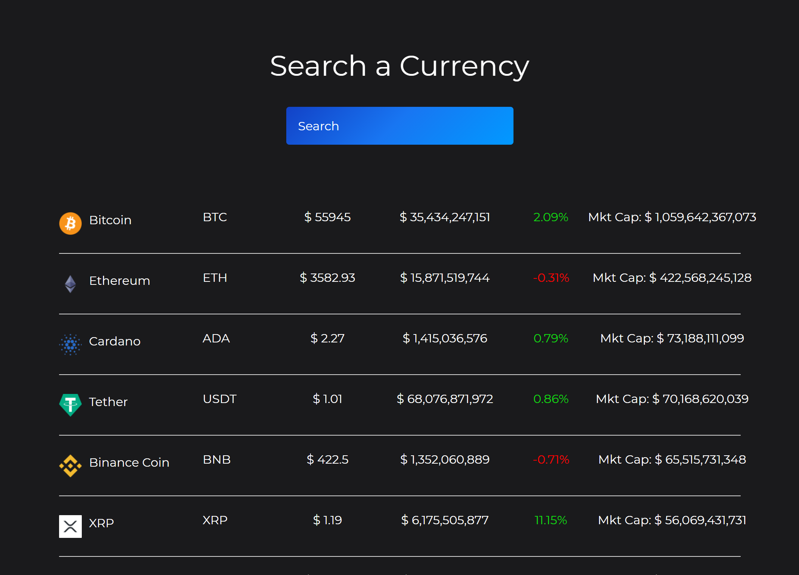

# crypto-tracker 

https://github.com/dthompasionas/crypto-tracker

Deployed:
https://crypto-tracker-v1.netlify.app/

# Description
An app to track the prices and info of crypto currencies

# Table of Contents
* [License](#license) 
* [Installation](#installation)
* [Tests](#tests)
* [Usage](#usage)
* [Contribute](#contribute)
* [Questions](#questions)

# License 
This project is licensed with a MIT license.

# Installation
The following necessary dependencies are required to run this app: npm i axios 

# Tests
The following command is needed to run test: npm start

# Usage
In order to use this app, refresh to get the most up to date info

# Contribute
contact below

# Screenshot:

# Questions
Contact me with any questions here:

*Github: dthompasionas

*email: dthompasionas@gmail.com 
